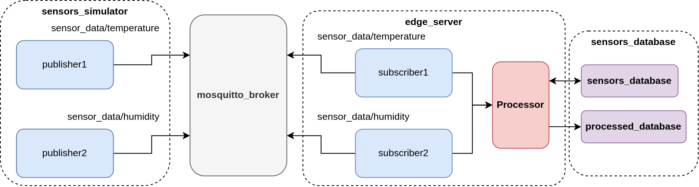

# IKERLAN Assestment: Edge Computing simulator

Welcome to the Edge Server simulator! This application simulates the information management from different sensors and the later processing of them. It also helps you understand the main benefits this paradigm has against other solutions. Here's a comprehensive guide to get you started.

⚠️ **Important**
> In [User guide](./docs/user_guide.md) you can found detailed information of how the simulator works.

## The system elements

The system is made up of four components. Each of them is executed inside a container. Lets see what these containers does:

- **sensors_simulator**: This container has the capability to generate information through MQTT topics called publishers. These publishers send JSON messages to the topic specified by the user. Due to the fact that this publishers are designed usign object-based programming, it is possible to generate or delete a great ammount of publisher typing few sentences. For more details, see [Sensors simulator](./docs/user_guide.md#sensors-simulator).

- **edge_server**: This container has the logic to listen for all the data that is sent from the simulated sensors. The way it is receiving informations is thanks to the subscription of various topics where the sensors publish data. It also has the methods to communicate with the database that store this type of information, to process the information retrieved from this database and the ability to store this new processed information into a new database. For more details, see [Edge server](./docs/user_guide.md#edge-server). 

- **mosquitto_broker**: This container actuates as the MQTT broker for both parts of the communication: subscribers and producers. In addition, autentication and autoritation methods have been implemented in the broker to guaranteed a higher level of security. For more details, see [Mosquitto broker](./docs/user_guide.md#mosquitto-broker). 

- **sensors_databases**: Last but not least, this container provides the way to store data sent from the simulated sensors that is received by the edge server. This container has two data bases: `sensors_database` and `processed_database`. The `sensors_database` has associated the `sensors_data` table that store all the raw sensors whereas the `processed_database` store the processed data from the raw data in the `processed_data` table. For more details, see [Sensors database](./docs/user_guide.md#sensors-database). 

## Operation

In order to explain how this simulator work, lets explain how the data flows from its generation to its final destination.

1. Publishers and subcribers connect to the **mosquitto_broker** using credentials (user/password). The use of this users autorize them to send or receive information to certain topics. Clients that do not autenticate in the broker will not be able to connect.

2. Data is generated from **sensors_simulator** container every 0.1 seconds. This data is included in a JSON message that is published into a certain topic. Two publishers are executed in this container. Therefore, two messages are sent every 0.1 seconds or, in other words, 20 messages per second are generated. One of the publishers sends the data to `sensor_data/temperature` topic while the other publisher sends this data to the `sensor_data/humidity` topic.

3. **edge_server** has two subscribers one that listens to `sensor_data/temperature` and the other that listens to `sensor_data/humidity`. Once the data is received, a connection to the **sensors_database** is created and the data is stored in the `sensors_data` table from the `sensors_database`.  

4. The data is stored as soon as it arrives to the subscribers. But, when the `sensors_data` table reaches more than 50 entries, this data is extracted and their values processed by a method from the `Processor` class. Basically, the `Processor` class is the class that provides all the processing and filtering functions for the edge server as well as the communication with both databases. In this case, an outliers filter is applied to those values. The result is stored to the `processed_data` table from `processed_database`. 

5. The 50 entries collected from the `sensors_data` table are deleted permanently as they are no longer useful because they where already proccesed.



## Running the Simulator

To run this simulator, different options exists. But first, make sure you are in the main folder of the project (`ikerlan-assestment` path).

- **Developer Environment**: Use the developer environment to see detailed events in both containers.

  - To build and start the development environment, use:

    ```bash
    ./docker/docker_start_up.bash --build-dev
    ```

  - To start without rebuilding, use:

    ```bash
    ./docker/docker_start_up.bash --dev
    ```

- **Production Environment**: For the production environment, you can build and start the service with:

  - To build and start:

    ```bash
    ./docker/docker_start_up.bash --build
    ```

  - To start without rebuilding:

    ```bash
    ./docker/docker_start_up.bash
    ```

For more docker details, see [Docker in the simulator](./docs/user_guide.md#docker)

