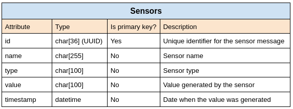
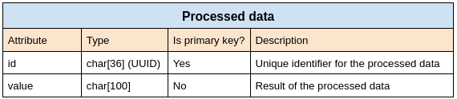

# User guide

Welcome to the user guide for this repository! Here you will find details about how the code was built in order to give a high level of clarity and context.

- [File structure](user_guide.md#file-structure)
- [Environments](user_guide.md#environments)
    - [Developer mode](user_guide.md#developer-mode)
    - [Normal mode](user_guide.md#normal-mode)
- [Docker](user_guide.md#docker)
  - [Scripts](user_guide.md#scripts)
  - [Docker compose files](user_guide.md#docker-compose-files)
  - [Docker images](user_guide.md#docker-images)
- [Sensors simulator](user_guide.md#sensors-simulator)
  - [Sensors simulator code](user_guide.md#sensors-simulator-code)
  - [Sensors simulator operations](user_guide.md#sensors-simulator-operations)
  - [Sensors simulator logs](user_guide.md#sensors-simulator-logs)
- [Edge server](user_guide.md#edge-server)
  - [Edge server code](user_guide.md#edge-server-code)
  - [Edge server operations](user_guide.md#edge-server-operations)
  - [Edge server logs](user_guide.md#edge-server-logs)
- [Mosquitto broker](user_guide.md#mosquitto-broker)
  - [Autentication](user_guide.md#autentication)
  - [Autorization](user_guide.md#autorization)
  - [Other security measures](user_guide.md#other-security-measures)
  - [Mosquitto logs](user_guide.md#mosquitto-logs)
- [Sensors database](user_guide.md#sensors-database)
  - [Initialization](user_guide.md#initialization)
  - [Persist database state](user_guide.md#persist-database-state)
  - [sensors_data table](user_guide.md#sensors_data-table)
  - [processed_data table](user_guide.md#processed_data-table)

## File structure

The system is organised in four folders:

- `docker`: Contains all the necessary files not only to build images (dependencies, entrypoints and configurations) but also some scripts that helps and makes easier the building, starting and stoping process of the docker images.

    Inside the docker folder we can observe that every image has its own folder where contains a folder for the dependencies, a bash script for the entrypoint and the dockerfile that designs the image.

- `docs`: Contains all the images and files that are necessary to understand this project. This file is inside this folder :)

- `logs`: This folder it is also divided in three different subfolders. The name of this subfolders match with the containers names. This is because every subfolder has the log files for the container that is naming. There are no logs for the database container.

- `src`: This folder it is also divided by subfolders with the containers names as each of these subfolders contains the code of each container. The **mosquitto_broker** container has no folder here as all of the configuration, as will be seen later, is located in its docker subfolder.

## Environments

In the section [Running the simulator](../README.md#running-the-simulator) from README file, the concept of developer and normal modes was introduced as a way to start up the simulator. 

### Developer mode

When the developer environment is selected by incorporing the `--dev` flag in the startup file. It basically provokes that the two handmade images, such as **edge_server** and **sensors_simulator**, can be executed with additional properties that in the normal mode are not offered. This properties are really useful for development as they provide:

- A way to execute the code in terminal rather than in the background which allows a better understanding of what is happening during the execution as well
- An easy way to interact with the system.
- Some additional docker volumes to apply updates of code without restarting the containers. 

### Normal mode

If the `--dev` flag is not activated, then the normal mode is executed which basically runs the whole system in the background. This approach is better when the program is fully developed and the user does not care about the state of the system but for the overral system functionality.

## Docker

### Scripts

Inside the docker folder we can also identify three scripts. As we said before, these scripts are designed to rapidly build, start and stop images.

#### docker_build.bash

This script builds all the images if it is executed with the `--all` flag. However, if no flags are typed this script will do nothing. It is possible also to build individually images using three different flags:

- `--sensor-sim` builds the **sensors_simulator** image. 
- `--mosquitto` builds the **mosquito_broker** image
- `--edge-server` builds the **edge_server** image.

For example executing:

```bash
./docker/docker_build.bash --edge-server --sensor-sim
```

will build two out of three images: the **edge_server** and the **sensors_simulator** image. 

#### docker_startup.bash

This script is used to run (and optionally build) the images. It contains also environmental variables which are later used by the containers to do version control of the images, autentication to the MQTT broker or setting upor not the variable that indicates if we are in developer environment or not.

If `--dev` flag is set, `DEV` variable will be set to true, and the `docker-compose-dev.yaml` will be execute. However, if no flag is set, the `docker-compose.yaml` is executed. The main difference between these two files is that `docker-compose-dev.yaml` provides additional volumes to facilitate developers tasks.

Additionally, if `--build-dev` is provided, the containers will not only be executed in developer mode, they will be built previous the execution.

#### docker_stop.bash

Basically executes the command:

```bash 
docker stop $(docker ps -a -q)
```

that stops all the docker containers that are currently running 

### Docker compose files

The docker compose files are the files that are used to run the simulator with certain properties. We have seen previously the difference between the two available docker compose files: `docker-compose-dev.yaml` and `docker-compose.yaml`. Let's see now all the properties that have in common:

- Privileged mode is set to false in order to guarantee that every container will be executed with the minimum but enough permissions.

- A network is created for all the four containers. This enables a way to establish static ip addresses to facilitate the communication between them. 

- As **mosquitto_broker** and **sensors_database** are the two containers that received requests, they have a port where they listen. 3306 for the database and 8883 for the broker.

- The environmental variables from the `docker_startup.bash` are shared with the containers to setup the containers environment.

### Docker images

#### edge_server

To build this image, four files are needed:

- `requirements.txt` and `install_basic.sh` are used to install python libraries and linux dependencies respectively. More especifically, this image has installed the paho-mqtt, mysql and numpy libraries. As for linux dependencies, two types of terminals are installed: xterm and gnome as well as the mysql client and ping-utils.

- The entrypoint plays an important role to start up the system and therefore, here is where the code is displayed in terminals or not depending if developer or normal mode was selected. Thanks to the `DEV` variable, it is possible to distinguish both casses.

- The dockerfile is used to add the code and dependencies inside the `python:3.9` image which is the one selected as base image. The dependencies scripts, once they are copied inside the container, they are executed to install the dependencies. The **edge_server** code located in `src/edge_server` is also copied so it can be executed later by the entrypoint. The netrypoint is also copied inside the container. Aditionally, a user and a group are also created in order to run the container as a less privileged user than root to maintain some security measures.    

Basically, this file waits until the **sensors_database** is up using the mysql client and later executes the edgeServer.py file which initialize the **edge_server** behaviour. If `DEV` is set to true, that is, developer mode was selected, this file is executed in a terminal.

#### sensors_simulator

To build this image, four files are needed:

- `requirements.txt` and `install_basic.sh` are used to install python libraries and linux dependencies respectively. More especifically, this image has installed the paho-mqtt library. As for linux dependencies, two types of terminals are installed: xterm and gnome as well as the mysql client and ping-utils.

- The entrypoint plays an important role to start up the system and therefore, here is where the code is displayed in terminals or not depending if developer or normal mode was selected. Thanks to the `DEV` variable, it is possible to distinguish both casses.

- The dockerfile is used to add the code and dependencies inside the `python:3.9` image which is the one selected as base image. The dependencies scripts, once they are copied inside the container, they are executed to install the dependencies. The **sensors_simulator** code located in `src/sensors_simulator` is also copied so it can be executed later by the entrypoint. The netrypoint is also copied inside the container. Aditionally, a user and a group are also created in order to run the container as a less privileged user than root to maintain some security measures.    

Basically, this file waits until the **sensors_database** is up using the mysql client and later executes the edgeServer.py file which initialize the **sensors_simulator** behaviour. If `DEV` is set to true, that is, developer mode was selected, this file is executed in a terminal.

#### mosquitto_broker

To build this image, these files are attached to the base image:

- A custom configuration file is copied inside config folder of the mosquitto image. This configuration file estabish the following rules:

    - Mosquitto broker listens to port 8883
    - Not autenticated user will not be able to connect
    - Only users registered in passwords.txt are able to connect to the broker.
    - The users are only able to subscribe o publish to certain topics defined in the acl.acl file.
    - The size of the packets and the queue is also limited to avoid congestion in the broker.

- Therefore, acl.acl file and password.txt, files that defined the users autorization and autentication respectively, are also copied inside the image in the same config folder.

#### sensors_database

No image is built from a dockerfile as it is directly using the mysql:latest image from the official docker repository.

## Sensors simulator

The logic for this image is made by the files found in `src/sensors_simulator`.

### Sensors simulator code 

#### SensorPublisher.py

This file contains the class `SensorPublisher`. This class provides methods and attributes necessary to generate a MQTT publisher that publishes every 0.1 seconds a JSON message made up of random data. An example of a message that generates is:

```bash
{
    "sensor_id": "sensor_7",
    "sensor_type": "type_2",
    "value": 56.783219042702,
    "timestamp": "2024-05-20T13:14:15.123456"
}
```
##### Methods

- **constructor**: expects a `clientID` to identify the object in the logs,  a `brokerAddress` and `brokerPort` where to connect the publisher, a `user` and `password` to autenticate the client and a `topic` where it publishes the random data show previously. Those parameters are save in attributes with the exception of the user and password which directly are applied to the MQTT client by using its method `username_pw_set()`. `on_connect`, `on_disconnect` and `on_publish` MQTT client callbacks are also filled with the `onConnect()` `onDisconnect()` and `onPublish()` **SensorPublisher** methods respectively.

- **start()**: Connects to the broker using the `brokerAddress` and `brokerPort` attributes.

- **onConnect(self, client, userdata, flags, rc)**: Is the callback that runs when the client connects to the user. Basically this method calls the `publishData()` method in a different thread (so it does not block the main thread) if the connection was successful. If not, it registers an error in the log file. 

- **publishData()**: Starts an infinite loop that sends a JSON message, with the format shown before, every 0.1 seconds. To publish the message, it basically executes the `publish()` method from the connected client. If it is not successfull, it generates an error message in the log file.

- **onDisconnect(self, client, userdata, rc)**: It registers an info message in the log file if the client disconencts from the broker.

- **onPublish(self, client, userdata, mid)**: It registers an info message in the log file every time the client publish a message.

- **stop()**: If this function is executed, it will disconnect the client. If is not able to do it, it will register an error message in the log file.

#### sensorsSimulator.py

This file is the one executed in the entrypoint from **sensors_simulator** image. Therefore, is the one that starts up its functionality. Basically, instantiates two objects from the class `SensorPublisher`. One of these object is instantiated with the topic `/sensor_data/temperature` whereas the other with the `/sensor_data/humidity` topic. Just after the instantiation is done, the `start()` method from those objects is called generating the production of a random JSON message every 0.1 seconds in each topic.

### Sensors simulator operations

1. Environmental values from `SIMULATOR_USER` and `SIMULATOR_PWD` have the user (`sensors_simulator` user) and password that enables the subscribing through the **mosquitto_broker** container. Also environmental values from `BROKER_ADDRESS` and `BROKER_PORT` to obtain the address and port where the **mosquitto_broker** container is listening.

2. A two time instantiation of a `SensorPublisher` class is done. In this instantiation the MQTT client will be filled with the callbacks and autentication values ready to be connected successfully with the broker.

3. The `start()` method is executed on each object. Publishers are now connected to the Mosquitto broker and are starting to send JSON messages.

4. Every 0.1 seconds, a JSON message is generated on each publisher and sent to the **mosquitto_broker** container.

5. If Ctrl + C is typed during the execution, both publisher will be disconnected using the `stop()` method.

### Sensors simulator logs

We have mention in the previous sections that some messages are stored in a log file. The `SensorPublisher` class uses the logging python library that enables the registration of logs during its execution. 

For this reason, a log file called `sensor_publishers.log` located in `/sensors_simulator/logs` is defined in order to register basic events from the running publishers. A docker volume from `logs/sensor_simulator` to that path will allow to check these logs from the host machine.

## Edge server

The logic for this image is made by the files found in `src/edge_server`.

### Edge server code 

#### ProcessedDataDatabase.py

This file contains the class `ProcessedDataDatabase`. This class provides methods and attributes necessary to communicate with the `processed_data` table from `ProcessedDataDatabase` effectively.

##### Methods

- **connect()**: Uses the mysql-connector libray to connect to the `ProcessedDataDatabase` database by givign the user and password to access the container and the IP and port where the **sensors_database** container listens.

- **addEntry(id, value)**: This method executes an INSERT query that creates a new entry in the `processed_data` table with the `id` and `value` given.

#### SensorsDataDatabase.py

This file contains the class `SensorsDataDatabase`. This class provides methods and attributes necessary to communicate with the `sensors_data` table from `SensorsDataDatabase` effectively.

##### Methods

- **connect()**: Uses the mysql-connector libray to connect to the `SensorsDataDatabase` database by giving the user and password to access the container and the IP and port where the **sensors_database** container listens.

- **addEntry(id, name, type, value, timestamp)**: This method executes an INSERT query that creates a new entry in the `sensors_data` table with the `id`, `name`, `type`, `value` and `timestamp` given.

- **hasNumberOfEntries(numberOfEntries)**: This method executes a SELECT query that obtains the number of current entries in the `sensors_data` table. This value is returned.

- **obtainNumberOfEntriesValues(numberOfEntries)**: This method executes a SELECT query that obtains a `numberOfEntries` number of `id`, `value` parameters stores in the `sensors_data` table.

- **deleteEntriesById(ids)**: This method executes a DELETE query that deletes every entries whose primary keys matches with on of the IDs given in the `ids` array.


#### Processor.py

This file contains the class `Processor`. This class provides methods and attributes necessary to process the message that arrives tp the MQTT subscribers. The process from this simulator includes the storaging and retrieving  

##### Methods

- **constructor**: instantiate a `ProcessedDataDatabase` and a `SensorsDataDatabase` and uses its `connect()` method to establish the connection with both databases from **sensor_database** container.

- **applyOutliersFilter(data)**: Executes an outliers filter to the array of data values. An outliers filter pretend to eliminate those values that are far from the mean of the whole dataset. Especifically this filter eliminates the values that are three estandar deviations from the mean. The result of this function is an arraay with the data values that are not that far from the mean.

- **applyProcessing(numberOfEntries)**: This method obtains a `numberOfEntries` number of id-value pairs from `sensors_data` table using the `obtainNumberOfEntriesValues()` from the `SensorsDataDatabase` object. The values obtained are used as parameter for the function `applyOutliersFilter()` and the results are stored in `processed_data` table by using `addEntry()` method from the `ProcessedDataDatabase` object. Thereafter, the entries used from `sensors_data` table are deleted by using the `deleteEntriesById()` method from the `SensorsDataDatabase` object using as parameter the ids obtained from the request.

- **storeMessage(message)**: This method extract the parameters from the JSON message and give them to the `addEntry()` method from the `SensorsDataDatabase` object to create an entry in the `sensors_data` table.

- **processMessage(message)**: This method calls first the `storeMessage()` methods to store the message in the `sensors_data` table. Then, checks the number of entries this table has and, if the entries exceed 50, will applied the a processing to the message described in the method `applyProcessing()`

#### MQTTSubscriber.py

This file contains the class `MQTTSubscriber`. This class provides methods and attributes necessary to generate a MQTT subscriber that listens to the topic given in the method `subscribe()`. 

##### Methods

- **constructor**: Expects a `clientID` to identify the object in the logs,  a `brokerAddress` and `brokerPort` where to connect the publisher and a `user` and `password` to autenticate the clien. Those parameters are save in attributes with the exception of the user and password which directly are applied to the MQTT client by using its method `username_pw_set()`. `on_connect` and `on_message` MQTT client callbacks are also filled with the `onConnect()` and `onMessage()` **MQTTSubscriber** methods respectively. It also instantiate an object from `Processor` class.

- **connect()**: Connects to the broker using the `brokerAddress` and `brokerPort` attributes.

- **onConnect(client, userdata, flags, rc)**: Is the callback that runs when the client connects to the user. If the connection was successful, register a info message in the log file. If not, it registers an error in the log file. 

- **subscribe(topic, QoS)**: It subscribes to a certain topic given in this method. Optionally a QoS level can be defined for this subscription connection (QoS=0 by default).

- **onMessage(self, client, userdata, msg)**: It is the callback that runs when the client receives a message from a topic that was subscribed. It calls the `processMessage()` method from the instantiated `Processor` object in the constructor method. 

#### edgeServer.py

This file is the one executed in the entrypoint from `edge_server` image. Therefore, is the one that starts up its functionality. Basically, instantiates two objects from the class `MQTTSubscriber`. One of these object is instantiated with the topic `/sensor_data/temperature` whereas the other with the `/sensor_data/humidity` topic. Just after the instantiation is done, the `connect()` and `subscribe()` methods from those objects are called to connect the subscriber to the Mosquitto broker and start listening to the indicated topic.


#### CustomLogger.py


### Edge server operations

1. Environmental values from `EDGE_SERVER_USER` and `EDGE_SERVER_PWD` have the user (`edge_server` user) and password that enables the publishing through the **mosquitto_broker** container. Also environmental values from `BROKER_ADDRESS` and `BROKER_PORT` to obtain the address and port where the **mosquitto_broker** container is listening.

2. A two time instantiation of the `MQTTSubscriber` class is done. In this instantiation, a MQTT client will be filled with the callbacks and autentication values ready to be connected successfully with the broker. Also, an instance of the class `Processor` is generated. This object will provide all the methods to process the messages. Furthermore, when instantiating this class `SensorsDataDatabase` and `ProcessedDataDatabase` are instantiated in this object and their `connect()` methods are executed to establish the communication with both databases as they are going to be used later.

3. The `connect()` and `subscribe()` method are executed on each object. Publishers are now connected to the Mosquitto broker and are starting to listen to JSON messages.

4. When a message arrives, `onMessage()` callback will receive and directly call the `processMessage()` method from the `Processor` class object.

5. Inside the `processMessage()` method, several methods are called. First one, the `storeMessage()` method will extract the parameters from the message and store it in the `sensors_database` by using the `addEntry()` method of the `SensorsDataDatabase` object.

6. Once message is stored, the `hasNumberofEntries()` method of the `ProcessedDataDatabase` object will compare if the current entries from the `sensors_data` table are higher than 50. If the method returns true, the `applyProccesing()` method is called.

7. The `applyProccesing()` method will call again another method from the `sensorsDataDatabase` object. In this case, the `obtainNumberOfEntriesValues()` will obtain 50 values and its corresponding primary keys. The will be used to delete the entries once the values where processed by the `applyOutliersFilter()` from the `Processor` instance. The results of this process are stored in the `processed_data` from the `processed_database` by using the `addEntry()` method of the `ProcessedDataDatabase` object. Finally, the entries processed are deleted from the `sensors_data` table using the `deleteEntriesById()` from the `sensorsDataDatabase` object.

8. If Ctrl + C is typed during the execution, both subscribers will be disconnected using the `loop_stop()` and `disconnect()` MQTT client methods.

### Edge server logs

The four classes that are involved in this process: `sensorsDataDatabase`, `ProcessedDataDatabase`, `Processor`and `MQTTSubscriber` instantiate a `CustomLogger` object which allow them to have a custom log file for each one of the classes. 

By giving the log file name and the path where should be stored and an ID, different messages can be registered by calling the logger attribute of this object. Optionally, the logging levels for the log file and log console can be set.

The paths for the storage of both four log files is `/edge_server/logs`s. A docker volume from `logs/edge_sensor` to that path will allow to check these logs from the host machine.

## Mosquitto Broker

This image has no added logic from my side but configuration that affects directly in its behaviour. This configuration was previously introduced in the [Docker images](user_guide.md#docker-images) section.

### Autentication

This configuration is done by generating a `passwords.txt` file that contains the users and its respectives encrypted passwords. In our use case we have three different users:

- `admin`: user generated that have access to all topics.
- `edge_server`: used in the **edge_server** image to subscribe to the topics.
- `sensors_simulator`: used in the **sensors_simulator** to publish to the topics.

### Autorization

In adittion to the autentication process made by the server, some restrictions to the user are also defined. These limitations affects the ability to subscribe or not to certain topics. This strategy is defined in the file `acl.acl` located in `docker/mosquitto_broker/config`

- The `admin`user is the only one that can subscribe and publish to any topic.
- The `sensors_simulator` user can only publish to two topics: `sensor_data/humidity` and `sensor_data/temperature`
- The `edge_server` user can only subscribe to two topics: `sensor_data/humidity` and `sensor_data/temperature`

### Other security measures 

- A white list approach is taken in the autentication process. Every user that is not registered as a defined user in `passwords.txt` will not be able to connect to the broker.

    - Sentence `allow_anonymous false` enable this approach.

- A limit to the queue is set to 1000 messages and the max_packet size is st to 1048576 bytes (1MB) in order to avoid possible congestions in the broker.

    - Sentencea `max_queued_messages 1000` and `max_packet_size 1048576` enable this approach.

### Mosquitto logs

Finally, a log destination file is defined by the sentence `log_dest file /mosquitto/log/mosquitto.log`. In this logs, every event is registered as the `log_type` is set to `all`. This configuration is located in `docker/mosquitto_broker/config/mosquitto.conf`. There is a volume that mirrors the log located in `/mosquitto/log` to the `logs/mosquitto_broker` host machine path. Therefore, this log can be analized from the host machine in the logs folder.

## Sensors database

### Initialization

The initialization of the container is done by introducing a sql file located in `src/sensors_database/sql` in the database entrypoint called `docker-entrypoint-initdb.d` using docker volumes. This sql file, called `init.sql`, is executed when the container launches for the very first time. 

`init.sql` creates the two databases: `sensors_database` and `processed_database` and their table `sensors_data` and `processed_data` respectively.

With the creation of this databases and tables, the sensor and processed data can be stored. 

### Persist database state

To persist the data stored in the databases, a volume is created. `src/sensors_batabase/data` will mirror the information from the database that need to be persisted. This information is the `/var/lib/mysql` database directory.

### sensors_data table

#### Requirements identification

- Main entities: sensors
- Sensor atributes: id, name, type, value, timestamp

#### Table design



### processed_data table

#### Requirements identification

- Main entities: processed data
- processed data atributes: id, processed_value

#### Table design 

